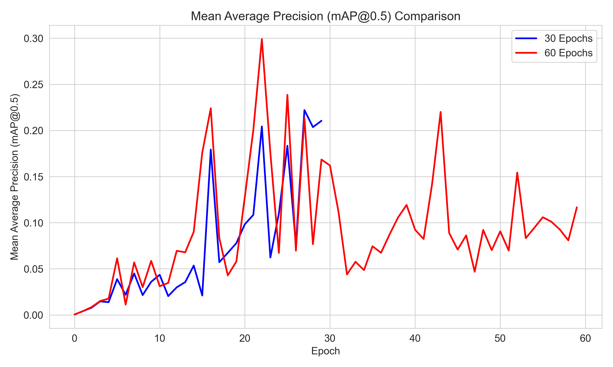
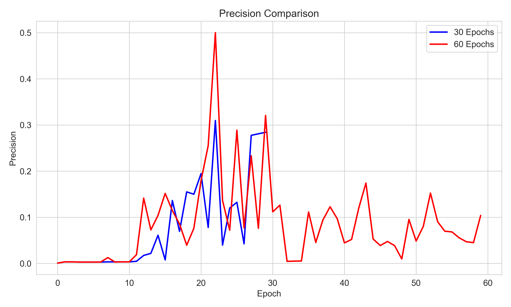
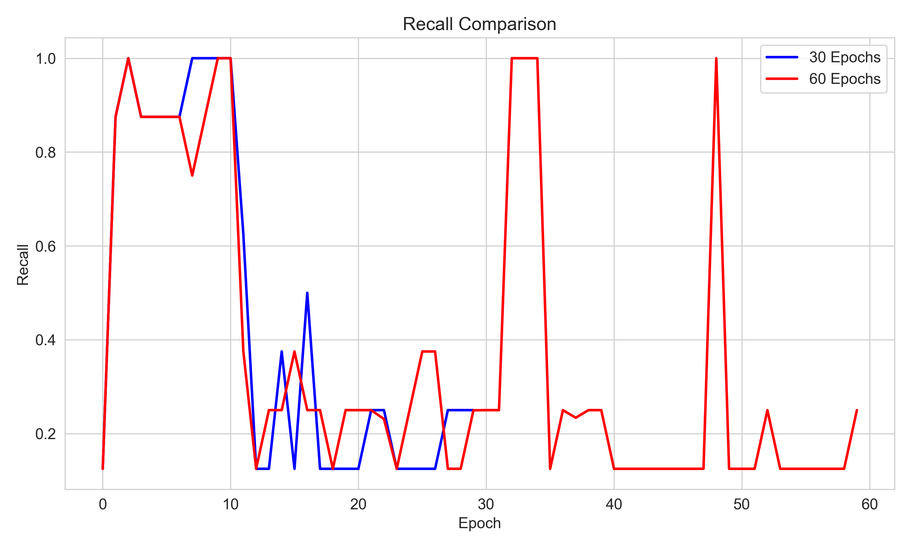
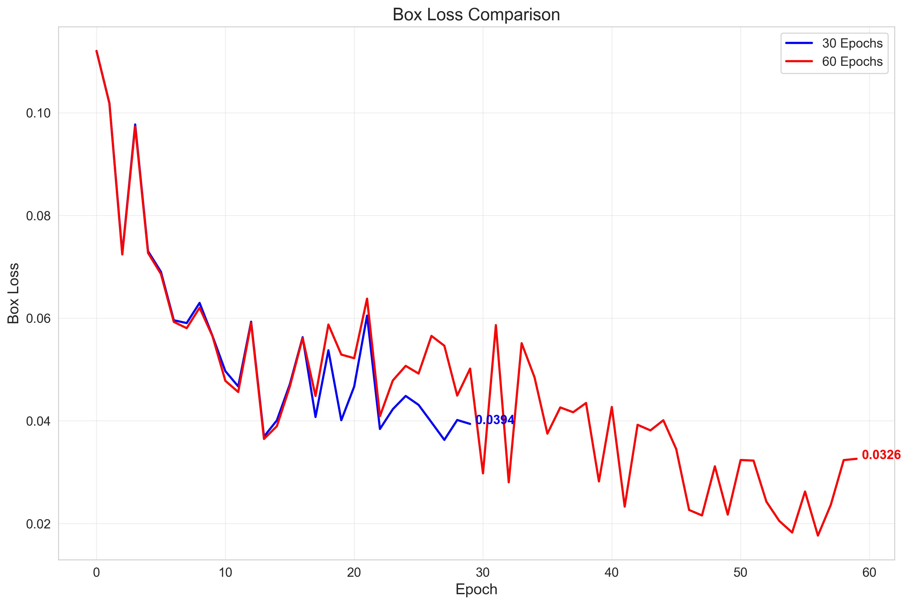
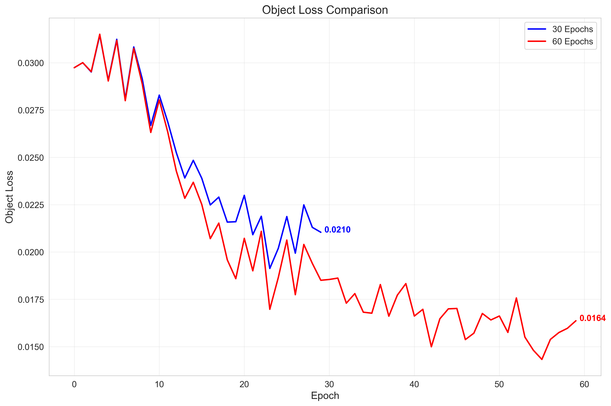
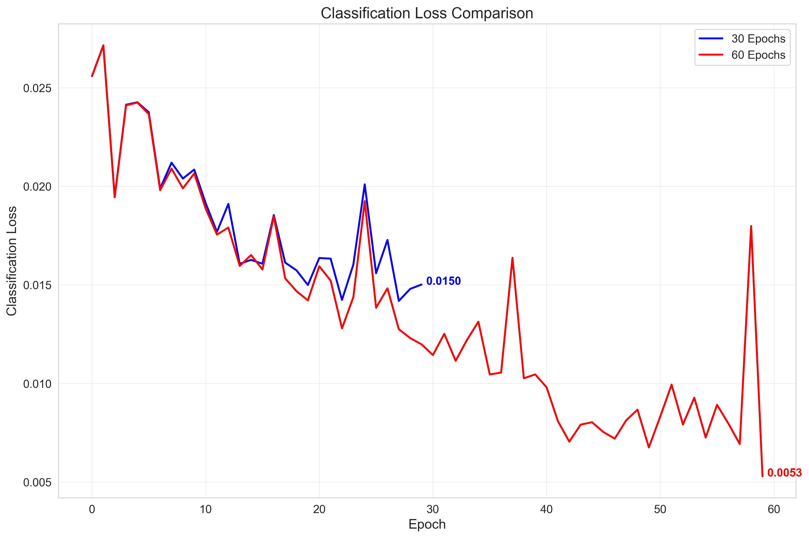
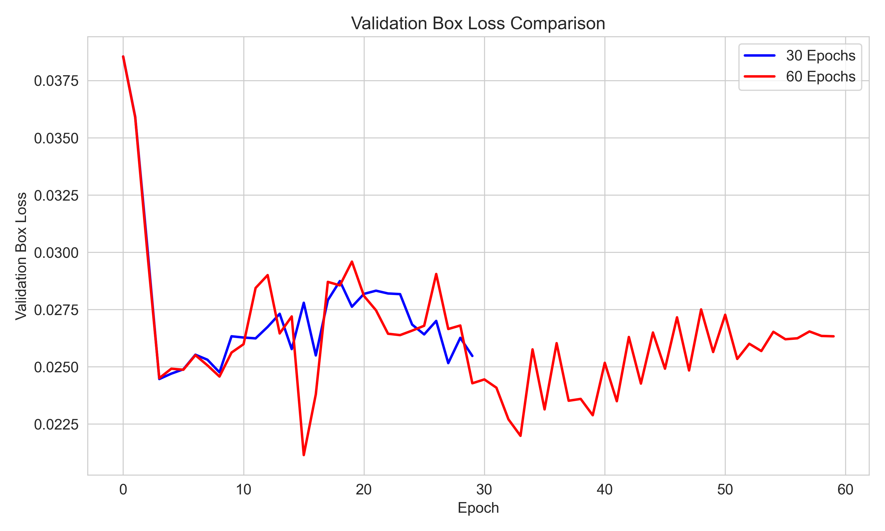
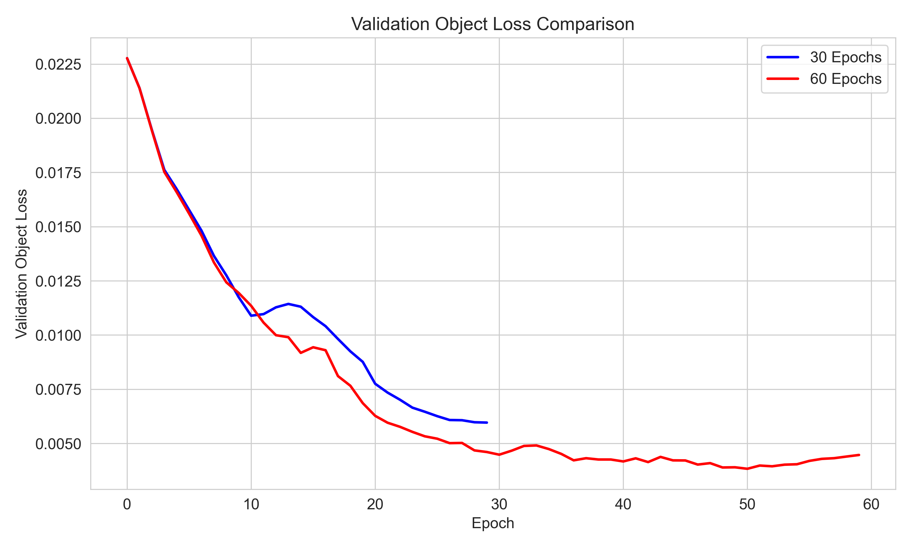

# YOLO Model Comparison: 30 Epochs vs 60 Epochs

## Final Metrics Comparison

| Metric | 30 Epochs | 60 Epochs | Difference | Percent Change |
|--------|---------|---------|------------|---------------|
| Mean Average Precision (mAP@0.5) | 0.2105 | 0.1167 | -0.0937 | -44.54% |
| Precision | 0.2841 | 0.1039 | -0.1802 | -63.43% |
| Recall | 0.2500 | 0.2500 | 0.0000 | 0.00% |

## Training Curves

### Mean Average Precision (mAP@0.5)

### Precision

### Recall

### Box Loss

### Object Loss

### Class Loss

### Validation Box Loss

### Validation Object Loss

