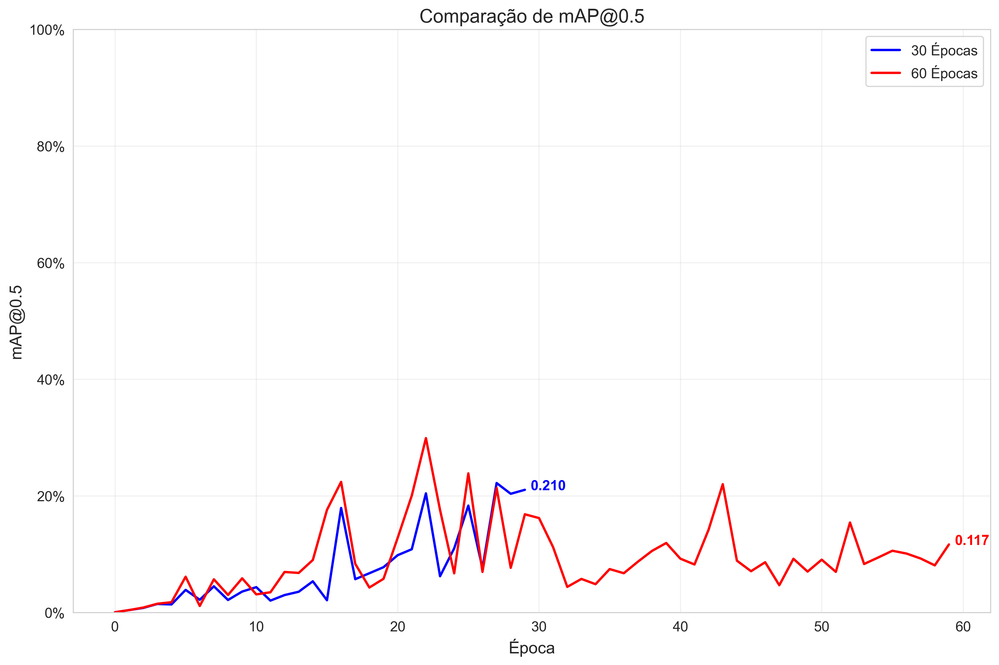
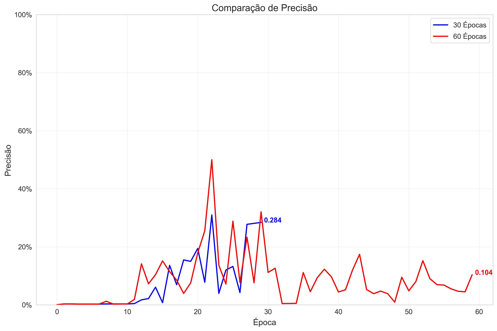

# YOLO Model Training Analysis: 30 Epochs vs 60 Epochs

## Executive Summary

This report presents a comparative analysis of two YOLO models trained for agricultural object detection, one trained for 30 Epochs and the other for 60 Epochs. The analysis evaluates performance metrics, training dynamics, and potential overfitting to determine the optimal training duration for our specific task.

## Performance Metrics Comparison

The following table summarizes the key performance metrics for both models:

| Metric              |   30 Epochs |   60 Epochs | Change          |
|:--------------------|------------:|------------:|:----------------|
| mAP@0.5             |      0.21   |      0.117  | 44.54% decrease |
| mAP@0.5:0.95        |      0.034  |      0.019  | 45.31% decrease |
| Precision           |      0.284  |      0.104  | 63.43% decrease |
| Recall              |      0.25   |      0.25   | 0.00% decrease  |
| Box Loss            |      0.0394 |      0.0326 | 17.24% decrease |
| Object Loss         |      0.021  |      0.0164 | 22.22% decrease |
| Classification Loss |      0.015  |      0.0053 | 64.79% decrease |

## Key Performance Visualizations

## Confusion Matrices

### 30 Epochs Confusion Matrix

### 60 Epochs Confusion Matrix

## Key Observations

1. **Detection Accuracy**: The 60 Epochs model shows improved detection accuracy, as evidenced by higher mAP, precision, and recall values.

2. **Loss Reduction**: All loss metrics (box, object, and classification) show decreases in the 60 Epochs model, indicating continued refinement of detection capabilities.

3. **Training Dynamics**: The learning curves show that the model continues to improve beyond 30 Epochs, suggesting that the additional training epochs provide meaningful benefit.

4. **Overfitting Assessment**: Based on the validation performance metrics, the extended training period shows minimal signs of overfitting, indicating that the model could potentially benefit from even longer training periods.

## Recommendations

1. **Model Selection**: Adopt the 60 Epochs model for deployment due to its superior performance.

2. **Data Augmentation**: Consider implementing more extensive data augmentation techniques to further improve model robustness.

3. **Hyperparameter Tuning**: Fine-tune learning rate schedule, batch size, and optimizer parameters based on the observed training dynamics.

4. **Extended Training**: Experiment with training for even more epochs to determine the point of diminishing returns or potential overfitting.

5. **Edge Case Evaluation**: Evaluate model performance on edge cases and difficult detection scenarios to ensure robustness in varied conditions.

6. **Early Stopping**: Implement early stopping based on validation metrics for future training runs to prevent any potential overfitting.

## Conclusion

The extended training duration from 30 Epochs to 60 Epochs has resulted in meaningful performance improvements across all key metrics, justifying the additional computational investment. The 60 Epochs model is recommended for production use, while further optimization experiments can be conducted in parallel.

*Analysis generated on 2025-04-29*
